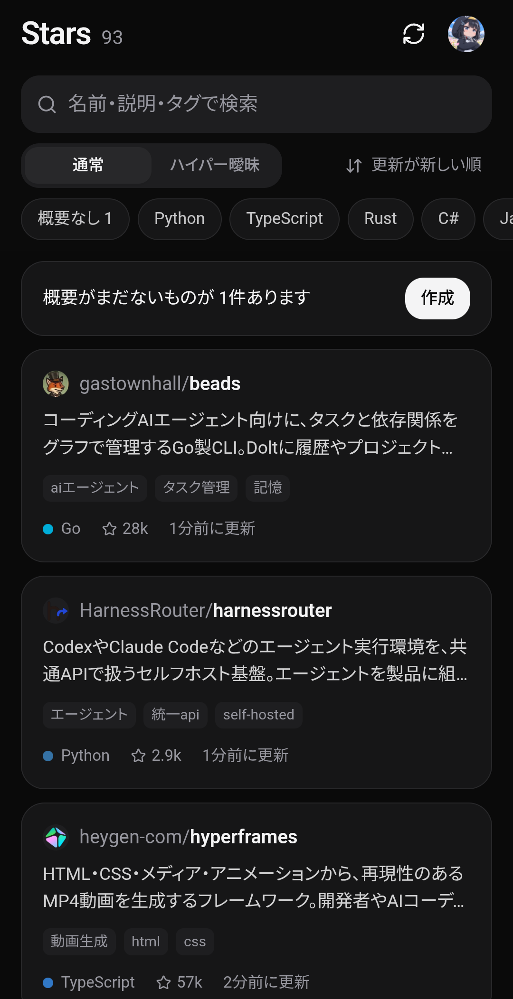

<p align="center">
  
</p>

<h1 align="center">Github Stars</h1>

<p align="center">
  GitHubでスターしたリポジトリを端末上で整理・検索できる Android アプリ<br>
  <sub>端末内で動作する公式 Codex（手持ちの ChatGPT アカウント）で概要を生成し、検索は完全オフラインで実行</sub>
</p>

<p align="center">
  <a href="../../releases/latest"></a>
  
  <a href="LICENSE"></a>
</p>

<p align="center"><a href="README.md">English</a></p>

---

スターしたリポジトリ一覧を取得し、端末上の Codex が各 README を解析して簡潔な概要（1〜2文）と検索用タグを生成します（日本語・英語対応）。

通常のキーワード検索に加え、**ハイパー曖昧検索**を搭載。「動画を落とすCLI」「あのターミナルのあいまい検索のやつ」といった自然言語の曖昧なクエリに対しても、オンデバイスの意思決定モデル（Laya multilingual 322M）が文脈を解釈し、意図に合致する順にリランキングします。

<p align="center">
  
</p>

## 主な機能

- **スターのローカル同期** — GitHub の Device Flow で認証（自身で作成した OAuth App を使用）し、スター済みリポジトリを端末にキャッシュします。
- **Codex による概要生成（オンデマンド）** — README をもとに、現在の表示言語で概要とタグを生成します。意図しない消費を防ぐため自動生成は行わず、「未生成のみ」「1件ずつ」「全件再生成（要確認）」から手動で実行します。モデルや推論の深さ（Reasoning Effort）は Codex のデフォルト設定に準拠し、設定画面での固定も可能です。
- **日英バイリンガル対応** — UI 全体の言語（日本語 / 英語）を切り替え可能。概要は選択中の言語で生成されます。言語を切り替えても他言語の既存データは保持され、未生成の言語のみ作成待ちとなります。
- **概要の永続化と履歴** — 生成された概要はローカルに保持され、再同期・ログアウト・言語切替・Codex 更新・処理中断などで失われません。再生成時も直前のバージョンに復元可能です。
- **ハイパー曖昧検索** — テキスト一致で絞り込んだ候補を、オンデバイスの意思決定モデル Laya multilingual（322M）が CPU 上でリランキング。GPU や外部通信は不要です。
- **柔軟な通常検索** — リポジトリ名・説明・トピック・生成タグを対象に、表記ゆれ（全角/半角、カタカナ/ひらがな）やタイポを許容して高速に検索します。
- **ライト / ダークテーマ** — システム設定に連動するシンプルなカード型 UI。

## Codex の連携仕様

本アプリが ChatGPT の非公開 API を直接呼び出すことはありません。公式の [`codex-app-server`](https://github.com/openai/codex) バイナリを無改変で同梱し、公開されている JSON-RPC インターフェース（`initialize`、`account/login/start`、`thread/start`、`turn/start`）経由で通信します。認証、トークン更新、モデルへのリクエスト処理はすべて Codex 自体が管理します。

- **ログイン**: ブラウザ経由での ChatGPT ログイン（リダイレクト先: 端末内 Codex `127.0.0.1:1455`）、またはデバイスコード認証に対応。
- **既定の動作**: Web 検索有効、サンドボックスはワークスペース書き込み、確認プロンプトなし（フルオート実行）。設定画面で変更可能です。
- **モデル / 推論の深さ**: デフォルトでは未指定とし、Codex 側の標準設定を使用します。利用可能なモデル一覧および推論の深さは実行時に Codex から動的に取得（`model/list`）するため、アプリのアップデートなしで新モデルを利用可能です。固定設定したモデルが提供終了となった場合は Codex のデフォルト設定へ自動的にフォールバックします。
- **Codex 本体の自動更新**: アプリ起動時（最短1時間間隔）に `openai/codex` の最新リリースを確認。新しい app-server がある場合はダウンロードし、GitHub 公開の SHA-256 ダイジェストによる検証およびスモークテストを経て切り替えます。起動に失敗した場合は同梱版へロールバックします（更新タイミングは Wi-Fi 接続時のみ / 常に / オフ を選択可能）。

静的リンクの musl バイナリを Android 上で動作させるため、以下の対応を行っています。

| Android での制約 | アプリ側の対応 |
|---|---|
| 実行ファイルはネイティブライブラリ用ディレクトリからしか実行できない | `libcodex_app_server.so` としてパッケージングし、インストール時に展開 |
| musl は `/etc/resolv.conf` で名前解決するが Android には存在しない | 起動ごとに認証情報を生成するループバック HTTPS（CONNECT）プロキシを配置し、Android の DNS リゾルバ経由で中継（Codex には `HTTPS_PROXY` で指定） |
| `/etc/ssl` が存在しない | Android の信頼済み証明書を PEM 形式で書き出し、`SSL_CERT_FILE` / `CODEX_CA_CERTIFICATE` で指定 |
| API 29 以上をターゲットにするとダウンロードした実行ファイルを実行できない | 自動更新機能の維持のため `targetSdkVersion` を 28 に設定（Termux と同様の構成） |

なお、Android 環境ではユーザー名前空間がサポートされないため（bubblewrap の制限）、Codex によるサンドボックス内でのシェルコマンド実行は動作しません。ただし概要生成においてはアプリ側で README を直接フェッチするため問題はなく、Codex はテキスト解析および必要な場合の Web 検索のみを行います。

## ハイパー曖昧検索の仕組み

1. **候補の絞り込み**: 入力クエリに基づき、リポジトリ名・説明・トピック、および生成済みの概要・タグから語句一致で候補を抽出します。
2. **オンデバイス推論**: 上位候補（10 / 20 / 30件、デフォルト: 20件）を **LiteRT** 経由で **Laya multilingual** に渡し、端末の **CPU のみ**（最大4スレッド）で推論を実行。各候補と検索クエリの適合確率を算出します（GPU 非搭載の端末でも動作します）。
3. **ストリーミング・リランキング**: 推論結果が得られた順に、モデルスコア（75%）と語句一致スコア（25%）を合成してリアルタイムに順位を更新します（適合度の低い候補は薄く表示）。

モデルアセットは非圧縮で APK 内に同梱しています。計算グラフは APK から直接ロードし、393MB の埋め込みテーブルはメモリマップ（mmap）されるため、ローカルストレージへの余計なファイルコピーは発生しません。ロード時のメモリ使用量は約 0.6〜1GB で、アプリがバックグラウンドに移行すると自動的に解放されます。初回検索時はモデルのロードに数秒を要しますが、以降の推論はハイエンド端末の CPU で1候補あたり約0.15秒（ミドルレンジ端末ではその数倍）で完了し、スコアが算出され次第順位へ反映されます。

※モデルスコア単体には依存せず語句一致スコアとハイブリッドで評価する構成のため、事前に生成された概要やタグの存在が検索精度（再現率）に大きく寄与します。

## セットアップ手順

1. **GitHub OAuth App の作成**（初回のみ）:
   GitHub → Settings → Developer settings → OAuth Apps → [New OAuth App](https://github.com/settings/applications/new) を開きます。Application name、Homepage URL、Authorization callback URL は任意の値で構いません。**Enable Device Flow** にチェックを入れ、発行された **Client ID** を控えます（Client Secret は不要です）。
2. [Releases](../../releases/latest) から APK をダウンロードしてインストールします（arm64、Android 8.0 以上対応）。
3. アプリを起動して言語（日本語 / English）を選択後、Client ID を入力して保存します。**コードを発行** をタップし、ブラウザの GitHub 画面で端末を承認します（Client ID は端末ローカルに保存され、設定画面から変更可能です）。
4. 概要を生成する場合は ChatGPT にログイン後、バナーの **作成**（または各リポジトリの詳細画面）から実行します。

※要求するスコープは公開データの読み取り権限のみです。プライベートリポジトリのスター情報にはアクセスしません。

## プライバシーとセキュリティ

- GitHub のアクセストークンは `EncryptedSharedPreferences` で暗号化保存されます。
- 同期したリポジトリ一覧、生成した概要、アプリ設定はすべて端末内の内部ストレージにのみ保存されます。
- 外部通信先は GitHub（API・Codex リリース確認）および Codex 経由の OpenAI エンドポイントのみです。
- ハイパー曖昧検索を含む推論処理はすべて端末内で完結（完全オフライン）します。

## ソースコードからのビルド

動作要件: JDK 17 以上、Android SDK（platform 35、build-tools 35）、Node.js 20 以上。

```sh
cd webui && npm ci && npm run build && cd ..
./gradlew assembleRelease
```

ビルドプロセス中に以下の外部アセットを自動取得し、SHA-256 ハッシュを検証します（リポジトリにはコミットされません）。

- 固定バージョンの openai/codex リリースから `codex-app-server-aarch64-unknown-linux-musl` → `build/generated/codexJniLibs`
- 固定リビジョンの Hugging Face リポジトリから Laya LiteRT アセット一式（約680MB）→ `.cache/laya-assets`

オフライン環境でビルドする場合は、Gradle 引数 `-PcodexBinary=/path/to/binary` および `-PlayaDir=/path/to/files` でローカルのファイルを指定可能です。
リリース署名には `keystore.properties`（`keystore.properties.example` 参照）または環境変数（`GHSTARS_*`）を使用します。
生成される APK のファイルサイズは約 0.8GB（モデルアセットを含む）です。

## ディレクトリ構成

```
app/src/main/java/dev/mokouliszt/githubstars/
  CodexRuntime.kt   app-server プロセス管理および JSON-RPC 通信
  CodexUpdater.kt   Codex のリリース確認・ダウンロード・検証・フォールバック
  LocalProxy.kt     musl バイナリ用のループバック CONNECT プロキシ
  GitHub.kt         Device Flow 認証、スター一覧取得、README 取得
  Summarizer.kt     日英概要のバッチ生成処理（構造化出力）
  HyperSearch.kt    Laya によるリランキング推論
  MainActivity.kt   WebView ホストおよび JS ブリッジ
app/src/main/java/com/laya/   Laya LiteRT ホスト実装（Apache-2.0、NOTICE 参照）
webui/                        フロントエンド（React + Tailwind CSS + Radix UI）
```

## ライセンス

MIT License。同梱しているサードパーティ製コンポーネント（Codex、Laya、LiteRT 等）はそれぞれのライセンスに従います。[NOTICE](NOTICE) および `third_party/licenses/` を参照してください。
