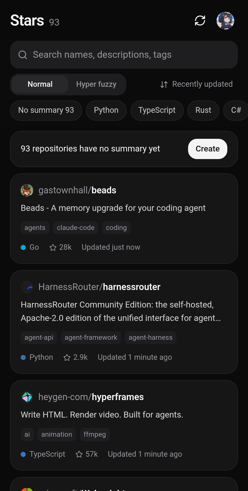

<p align="center">
  
</p>

<h1 align="center">Github Stars</h1>

<p align="center">
  An Android app to browse and search your starred GitHub repositories.<br>
  <sub>Generates summaries with official Codex running on-device using your ChatGPT account; search runs fully offline.</sub>
</p>

<p align="center">
  <a href="../../releases/latest"></a>
  
  <a href="LICENSE"></a>
</p>

<p align="center"><a href="README.ja.md">日本語版はこちら</a></p>

---

Github Stars syncs your starred repositories locally and uses the official Codex binary on-device
to generate concise 1–2 sentence summaries and search tags from each repository's README (in English or Japanese).

In addition to standard lexical search, the app features **hyper fuzzy search**: query using natural language
(e.g., "CLI for grabbing videos" or "あのターミナルのあいまい検索のやつ"), and an on-device decision model
(Laya multilingual 322M) re-ranks candidates by semantic relevance.

<p align="center">
  
</p>

## Features

- **Local Star Sync** — Authenticates via GitHub OAuth Device Flow (using your own OAuth App) and caches starred repositories locally.
- **On-Demand Codex Summaries** — Generates short summaries and search tags from READMEs in the active language. Generation is never automated; trigger it manually for unsummarized repositories, individual entries, or all repositories (with confirmation). Reasoning effort and model selection follow Codex defaults unless pinned.
- **Bilingual Support (JA / EN)** — Toggle the UI between Japanese and English. Summaries are generated in the active language, while existing summaries in the other language are preserved.
- **Persistent Storage & History** — Generated summaries persist across re-syncs, logouts, language switches, Codex updates, and interruptions. Re-generating retains the previous version for rollback.
- **Hyper Fuzzy Search** — Lexical candidates are re-ranked on-device by the Laya multilingual decision model (322M parameters) using LiteRT on CPU. No GPU or network connection required.
- **Fault-Tolerant Lexical Search** — Searches repository names, descriptions, topics, and generated tags with support for typos, full-width/half-width characters, and kana normalization.
- **System Theme Integration** — Clean card-based UI supporting light and dark modes.

## How Codex is Used

The app does **not** call private ChatGPT endpoints directly. It bundles the official, unmodified
[`codex-app-server`](https://github.com/openai/codex) binary and communicates via its documented
JSON-RPC interface (`initialize`, `account/login/start`, `thread/start`, `turn/start`). Authentication,
token refresh, and model requests are handled entirely by Codex itself.

- **Authentication**: Browser-based ChatGPT login (redirecting to local Codex on `127.0.0.1:1455`) or device-code flow.
- **Default Behavior**: Live web search enabled, workspace-write sandbox, full-auto execution (no approval prompts). Configurable in Settings.
- **Model / Reasoning Effort**: Left unset by default to follow Codex upstream defaults. Available models and reasoning levels are fetched dynamically from Codex at runtime (`model/list`), making new models available without app updates. Pinned models automatically fall back to Codex defaults if deprecated.
- **Codex Updates**: Checks for newer `openai/codex` releases on startup (at most hourly). New app-server binaries are downloaded, verified against GitHub's published SHA-256 digests, smoke-tested, and activated. If launch fails, the app rolls back to the bundled binary (Update triggers: Wi-Fi only / Always / Off).

To run a static musl binary on Android, the following accommodations are implemented:

| Android Constraint | Implementation |
|---|---|
| Executables can only run from the native library directory | Packaged as `libcodex_app_server.so` (extracted at installation) |
| musl resolves DNS via `/etc/resolv.conf`, which does not exist on Android | A loopback HTTPS (CONNECT) proxy with per-launch credentials bridges DNS resolution via Android's native resolver (`HTTPS_PROXY`) |
| `/etc/ssl` does not exist | Android's trusted system CA certificates are exported to a PEM bundle and passed via `SSL_CERT_FILE` / `CODEX_CA_CERTIFICATE` |
| Downloaded binaries cannot execute on apps targeting API 29+ | `targetSdkVersion` is set to 28 to permit running downloaded updates (the same approach used by Termux) |

Because Android does not support the user namespaces required by bubblewrap, sandbox shell execution is unavailable. This does not impact summary generation: the app fetches READMEs directly via the GitHub API, leaving Codex strictly responsible for text processing and web searches.

## How Hyper Fuzzy Search Works

1. **Candidate Retrieval**: Matches the query lexically against repository names, descriptions, topics, and generated summaries/tags.
2. **On-Device Inference**: Top candidates (10 / 20 / 30, default: 20) are sent to **Laya multilingual** via **LiteRT on CPU** (up to 4 threads; GPU is not required). The model evaluates semantic relevance and outputs a calibrated probability score for each repository.
3. **Streaming Re-ranking**: As scores arrive, results are dynamically re-ordered using a weighted score (75% model probability, 25% lexical match). Low-confidence items are visually dimmed.

The model is bundled within the APK as uncompressed assets. The computation graph is loaded directly from the APK, and the 393 MB embedding table is memory-mapped (`mmap`) to avoid copying files to disk. Active RAM usage is approximately 0.6–1.0 GB during inference and is released when the app is backgrounded. Cold-start model loading takes a few seconds; subsequent inference completes in ~0.15s per candidate on modern flagship CPUs (slightly longer on mid-range devices), updating rankings in real time.

*Note: Combining model scores with lexical relevance ensures high precision, while pre-generated summaries and tags provide critical coverage for recall.*

## Setup

1. **Create a GitHub OAuth App** (one-time setup):
   Navigate to GitHub → Settings → Developer settings → OAuth Apps → [New OAuth App](https://github.com/settings/applications/new). Application name, Homepage URL, and Authorization callback URL can be set to any values. Check **Enable Device Flow**, and note the generated **Client ID** (no Client Secret is needed).
2. Install the APK from [Releases](../../releases/latest) (arm64, Android 8.0+).
3. Open the app, select your preferred language (日本語 / English), enter your Client ID, and save. Tap **Get code** and approve the session on GitHub (Client ID is saved locally and can be modified in Settings).
4. To generate summaries, log in to ChatGPT and tap **Create** on the home banner (or open an individual repository).

*Note: The app only requests read permissions for public data; private starred repositories are never accessed.*

## Privacy & Security

- The GitHub access token is stored securely using `EncryptedSharedPreferences`.
- Starred repositories, generated summaries, and preferences remain strictly within internal app storage.
- Outbound network traffic is limited to GitHub (API, Codex release checks) and OpenAI endpoints through Codex. Hugging Face is only accessed during build time.
- All search operations, including hyper fuzzy search, run completely on-device without network access.

## Building from Source

Prerequisites: JDK 17+, Android SDK (platform 35, build-tools 35), Node.js 20+.

```sh
cd webui && npm ci && npm run build && cd ..
./gradlew assembleRelease
```

The build process downloads and verifies (SHA-256) external assets not tracked in git:

- Pinned `codex-app-server-aarch64-unknown-linux-musl` release → `build/generated/codexJniLibs`
- Pinned Hugging Face Laya LiteRT assets (~680 MB) → `.cache/laya-assets`

For offline builds, supply local asset paths via `-PcodexBinary=/path/to/binary` and `-PlayaDir=/path/to/files`.
Release signing uses `keystore.properties` (see `keystore.properties.example`) or `GHSTARS_*` environment variables.
The resulting APK is approximately 0.8 GB, primarily due to the bundled search model.

## Project Structure

```
app/src/main/java/dev/mokouliszt/githubstars/
  CodexRuntime.kt   app-server process lifecycle and JSON-RPC bridge
  CodexUpdater.kt   Codex release checks, downloading, validation, and fallback
  LocalProxy.kt     Loopback CONNECT proxy for musl binary compatibility
  GitHub.kt         OAuth Device Flow, starred repository sync, README fetching
  Summarizer.kt     Structured batch summary generation (JA/EN)
  HyperSearch.kt    Laya re-ranking inference
  MainActivity.kt   WebView host and JavaScript bridge
app/src/main/java/com/laya/   Laya LiteRT host integration (Apache-2.0, see NOTICE)
webui/                        Frontend UI (React + Tailwind CSS + Radix UI)
```

## License

MIT License. Bundled third-party components (Codex, Laya, LiteRT, etc.) retain their respective licenses. See [NOTICE](NOTICE) and `third_party/licenses/`.
